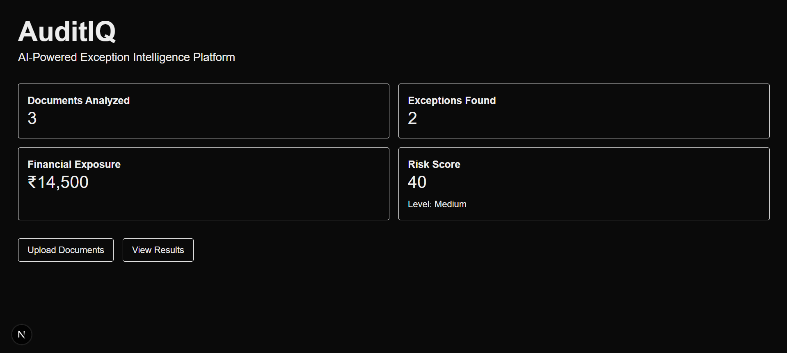
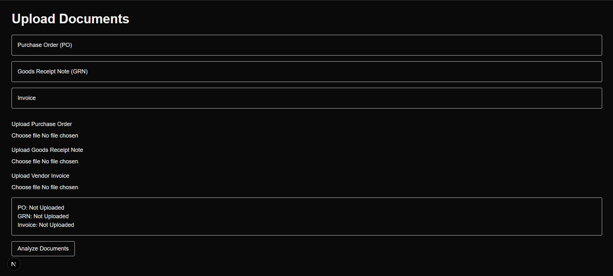
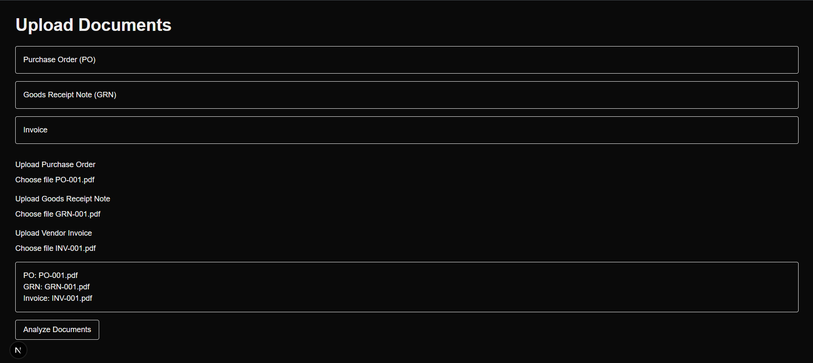
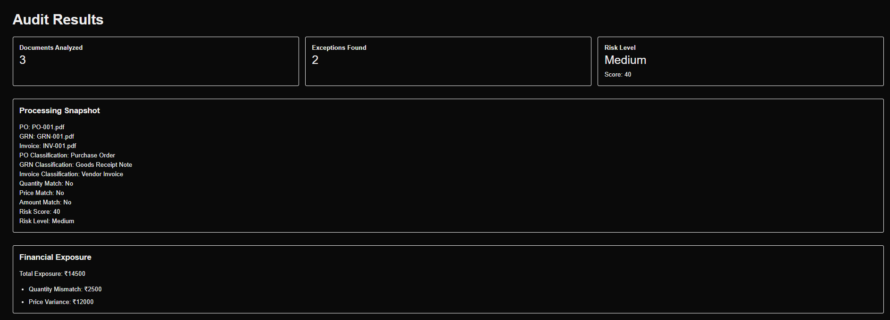
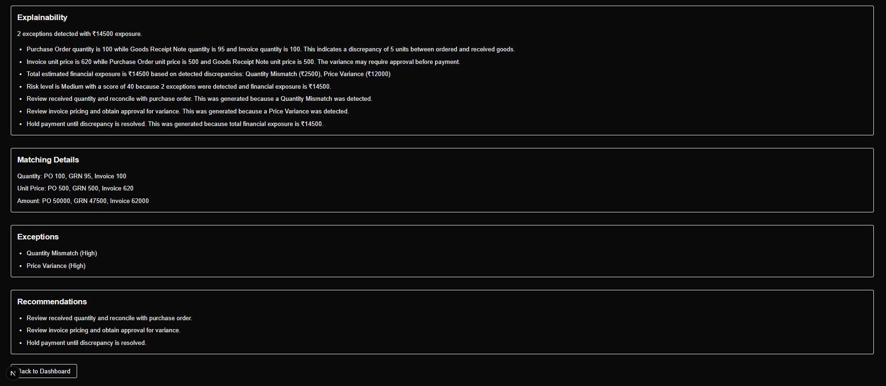

# AuditIQ

AuditIQ is a Next.js application for three-way document analysis across Purchase Orders, Goods Receipt Notes, and Vendor Invoices.

## Problem Statement

Finance and audit teams often review procurement documents manually to catch mismatches, exception patterns, and exposure risk. That process is slow, repetitive, and hard to standardize across cases.

## Solution Overview

AuditIQ provides a lightweight web-based workflow that accepts three documents, runs them through a deterministic analysis pipeline, and presents the resulting exceptions, exposure, risk, recommendations, and explainability in a structured results view.

Blueprint V1 is complete and the current repository reflects that MVP state.

## Application Screenshots











## Features

- Upload PO, GRN, and Invoice documents
- Classify uploaded filenames into document types
- Extract structured document data
- Perform three-way matching across quantity, unit price, and amount
- Detect procurement exceptions
- Calculate estimated financial exposure
- Derive a risk score and risk level
- Generate recommendations
- Generate explainability output
- Persist a single analysis snapshot in session storage
- View KPI summaries on the dashboard and detailed results on the results page

## System Workflow

```text
Upload Documents
↓
Classification
↓
Extraction
↓
Three-Way Matching
↓
Exception Detection
↓
Financial Exposure
↓
Risk Assessment
↓
Recommendation Engine
↓
Explainability
↓
Results
```

## Architecture

AuditIQ uses the Next.js App Router with page-level orchestration and small synchronous analysis engines in `src/lib`.

- `src/app/upload/page.tsx` orchestrates the pipeline and stores the latest analysis snapshot
- `src/app/results/page.tsx` reads the snapshot and renders the detailed result experience
- `src/app/page.tsx` renders dashboard KPIs from the latest stored analysis when present
- `src/lib/*` contains the rule-based engines for classification, extraction, matching, exceptions, exposure, risk, recommendations, and explainability

The current architecture is intentionally simple and browser-local. It is designed to demonstrate the V1 workflow without introducing backend infrastructure.

## Technology Stack

- Next.js 16
- React 19
- TypeScript 5
- Tailwind CSS v4
- ESLint 9

## Project Structure

```text
.
├── AuditIQ_Source_Inventory.md
├── README.md
├── docs
│   ├── architecture.md
│   └── project-overview.md
├── public
│   ├── file.svg
│   ├── globe.svg
│   ├── next.svg
│   ├── vercel.svg
│   └── window.svg
├── src
│   ├── app
│   │   ├── favicon.ico
│   │   ├── globals.css
│   │   ├── layout.tsx
│   │   ├── page.tsx
│   │   ├── results
│   │   │   └── page.tsx
│   │   └── upload
│   │       └── page.tsx
│   └── lib
│       ├── classifier.ts
│       ├── exceptionEngine.ts
│       ├── explainability.ts
│       ├── extractor.ts
│       ├── financialExposure.ts
│       ├── matcher.ts
│       ├── recommendationEngine.ts
│       └── riskEngine.ts
├── package.json
├── tsconfig.json
├── eslint.config.mjs
├── next.config.ts
└── postcss.config.mjs
```

Notes:

- `src/components` is not present in the current codebase
- `src/types` is not present in the current codebase

## Local Setup Instructions

```bash
npm install
npm run dev
```

Then open:

```text
http://localhost:3000
```

Helpful commands:

```bash
npm run build
npm run lint
```

## Current Limitations

- Mock Classification: filenames are used instead of document OCR or semantic parsing
- Mock Extraction: extracted values are deterministic fixtures, not parsed document content
- SessionStorage Persistence: the analysis snapshot is browser-local and temporary
- Duplicate Invoice Framework (Partial): the exception exists, but the current upload flow does not provide persistent invoice history

## Roadmap

### Completed

- App Router structure
- Upload page analysis pipeline
- Results page rendering
- Dashboard KPI summary
- Exception detection
- Financial exposure calculation
- Risk scoring
- Recommendation generation
- Explainability generation

### In Progress

- None in the current repository state; Blueprint V1 is the active baseline

### Future Enhancements

- Replace mock classification with real document understanding
- Replace mock extraction with OCR or structured document parsing
- Add durable persistence beyond session storage
- Introduce persistent duplicate-invoice history
- Add authentication and role-based access
- Add automated tests and fixture coverage
- Add production telemetry and error reporting
