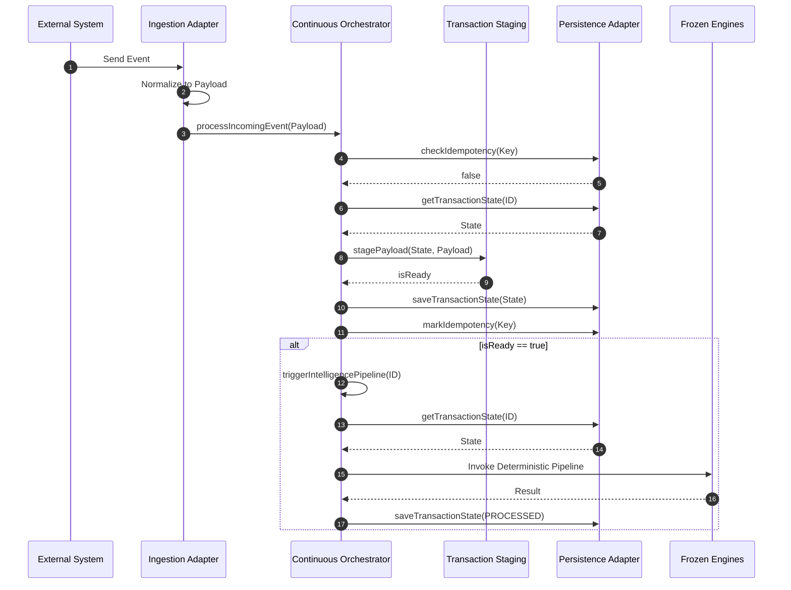
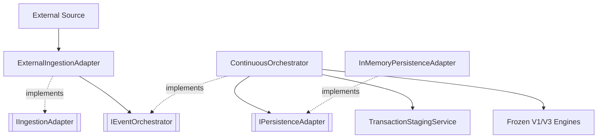
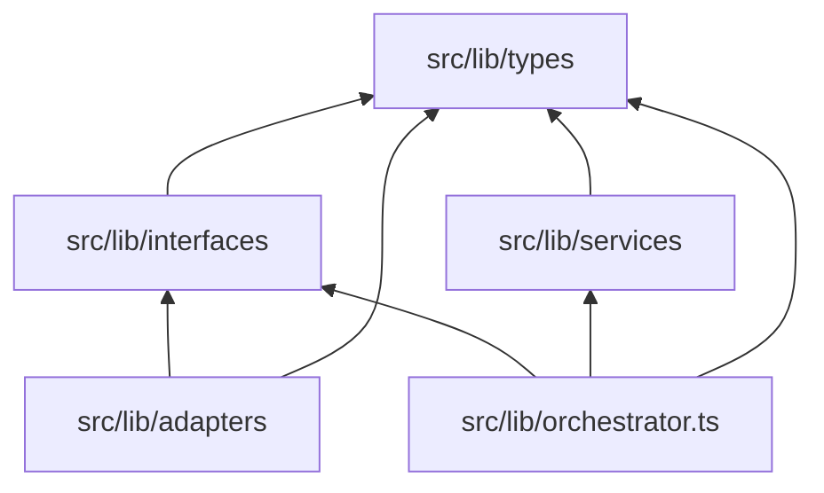

# Blueprint V4 — Section 14.3: Continuous Monitoring Architecture

## 1. Purpose
Continuous Monitoring introduces the capability to asynchronously ingest, stage, and orchestrate out-of-order transactional data (Purchase Orders, Goods Receipts, Invoices) from external sources. It provides a robust, idempotent boundary that safely bridges external enterprise systems with AuditIQ's deeply deterministic V1/V3 intelligence engines without coupling them to specific message queues or databases.

## 2. Architecture Overview
- **Continuous Monitoring Boundary**: Isolates asynchronous event handling from synchronous business logic.
- **Canonical Contracts**: Standardizes external events into `IngestionPayload` and `TransactionState` structures.
- **Orchestration**: Manages the operational lifecycle of a transaction without making business decisions.
- **Transaction Staging**: Aggregates partial documents until they form a mathematically ready transaction.
- **Persistence**: Abstract layer managing operational staging data.
- **Deterministic Intelligence Pipeline**: The frozen V1/V3 engines that execute exclusively once a transaction crosses the readiness threshold.

## 3. Component Responsibilities
- **ContinuousOrchestrator**: Coordinates ingestion, staging readiness checks, and invocation of intelligence pipelines.
- **TransactionStagingService**: Inspects payloads to structurally evaluate if PO + GRN + Invoice are present.
- **ExternalIngestionAdapter**: Reference transport adapter; normalizes unknown payloads into canonical contracts.
- **InMemoryPersistenceAdapter**: Reference operational datastore; tracks staging state and idempotency.
- **Continuous Contracts**: Pure structural definitions (`IngestionPayload`, `TransactionState`).
- **Continuous Interfaces**: Abstract boundaries (`IPersistenceAdapter`, `IIngestionAdapter`, `IEventOrchestrator`).

## 4. Runtime Responsibility Matrix
| Responsibility | Owner |
|---------------|-------|
| Receive Event | Ingestion Adapter |
| Validate Idempotency | Continuous Orchestrator |
| Ignore Duplicate Events | Continuous Orchestrator |
| Stage Transaction | Persistence Adapter |
| Determine Transaction Readiness | Continuous Orchestrator / Staging Service |
| Invoke Deterministic Pipeline | Continuous Orchestrator |
| Three-Way Matching | Frozen V1 Engine |
| Exception Detection | Frozen V1 Engine |
| Financial Exposure | Frozen V1 Engine |
| Risk Assessment | Frozen V1/V3 Engine |
| Predictive Intelligence | Frozen V3 Engine |
| Persist Operational State | Persistence Adapter |

## 5. End-to-End Sequence Diagram

## 6. Component Diagram

## 7. Repository Dependency Diagram

## 8. Data Flow
External Event
↓
Canonical Payload
↓
Orchestrator
↓
Staging
↓
Persistence
↓
Deterministic Engines
↓
Operational State

## 9. Architectural Invariants
- **Deterministic Business Core**: The intelligence engines are completely uncoupled from streaming state.
- **Extension over Modification**: Achieved purely via new modular classes.
- **Layer Isolation**: The orchestrator possesses zero knowledge of database or HTTP drivers.
- **Stable Contracts**: External event chaos is flattened strictly into `IngestionPayload`.
- **Technology Independence**: Guaranteed via reference adapters and pure TypeScript interfaces.

## 10. Extension Guide
- **New Persistence Adapters**: Implement `IPersistenceAdapter` using a specific driver (e.g. PostgreSQL, Redis). Inject it into `ContinuousOrchestrator`.
- **New Ingestion Adapters**: Implement `IIngestionAdapter`. Normalize specific schemas (e.g., SAP, Oracle) into `IngestionPayload`.
- **New Transport Layers**: Handle transport validation, then pass the arbitrary payload to an Ingestion Adapter.

## 11. Known Limitations
- `InMemoryPersistenceAdapter` is a reference implementation only and lacks durability across restarts.
- Enterprise persistence belongs to future implementations.
- Dead Letter Queue (DLQ) and fault retries are future Blueprint work.
- Enterprise transport adapters (Kafka, REST webhooks) are future Blueprint work.

## 12. Repository Impact Summary
- **Files Created**: `continuous.ts`, `continuousInterfaces.ts`, `orchestrator.ts`, `transactionStagingService.ts`, `inMemoryPersistenceAdapter.ts`, `externalIngestionAdapter.ts`.
- **Files Modified**: None outside of Section 14.3.
- **Public Contracts**: `IngestionPayload`, `TransactionState`.
- **Public Interfaces**: `IPersistenceAdapter`, `IIngestionAdapter`, `IEventOrchestrator`.
- **Repository Boundaries**: Introduced the asynchronous continuous boundary without modifying the synchronous deterministic core.
